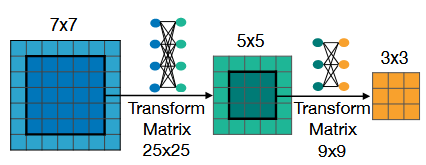

- Han Cai, Chuang Gan, Tianzhe Wang, Zhekai Zhang, Song Han
- ICLR 2020
#### 总结
不同的运行条件，最佳模型架构有很大的差异。传统方法在面对新的部署场景时都要重新设计网络结构，并且从头开始训练，成本与部署场景的数量呈线性关系。本文提出一种一次性训练解决所有场景的网络结构，此方法将训练和网络结构搜索解耦，面对不同的场景，派生出合适的子网络。此方法成本集中于训练，后续的派生过程成本可以忽略不记，因此是一个常量。
#### 背景
对于不同的硬件资源（例如片上内存大小、算术单元），最佳神经网络结构差异很大。即使在相同的硬件上运行，在不同的电池条件或工作负载下，最佳模型架构也有很大差异
面对不同的部署场景时，传统的方法通过手动设计或神经网络结构搜索NAS找到适合的网络结构。此类方法需要重复网络设计过程并且需要针对每种情况从头开始重新训练设计的网络。部署成本随着部署场景数量的增加而线性增长
早期的NAS方法不考虑硬件效率，因此推理效率不高。近期的NAS方法融合了硬件效率，提高了推理效率，但是面对新场景，需要重复结构搜索并且从头训练，无法拓展到大量部署场景
动态网络根据输入图像跳过给定模型的部分结构，提高推理效率。但这些方法仍然基于提前设计好的模型，限制了灵活程度
#### 方法
针对不同的部署场景选择整个网络的一部分去执行推理。支持不同的深度、宽度、核大小和分辨率，因此灵活度更高。具体来说，将模型的训练和网络结构搜索解耦：
- 训练阶段，专注于提高通过整个网络的不同部分派生的所有子网络的准确性
- 搜索阶段，对子网络的子集进行采样来训练准确性和延迟预测器
- 给定目标硬件和相关约束，利用预测器进行结构搜索
训练阶段和搜索阶段所用时间是常量，而针对特定部署场景进行结构搜索的时间可以忽略不计，因此这种方法效率很高，所用时间是一个常量与部署场景数量无关
#### 要点
训练整个网络是不容易的，因为需要联合优化权重来维持大量子网络的准确性：
- 联合优化权重： $min_{W_o} \sum_{arch_i} \zeta_{val}(C(W_o,arch_{i}))$
- 大量子网络：任意数量的层（弹性深度）、任意数量的通道（弹性宽度）、任意内核大小（弹性内核大小）、任意输入图像大小（弹性分辨率）
	- 5个单元
	- 每单元层数 $\{1,2,3\}$
	- 每层通道数 $\{3,4,6\}$
	- 核大小 $\{3,5,7\}$
	- 子网络总数：$((3\times3)^2+(3\times3)^3+(3\times3)^4))^5\approx2\times10^{19}$
		- 第一部分两层，每层宽度和核大小三种，因此是$(3\times3)^2$ ，其余层同理
枚举所有子网络一次性训练与子网络数量呈线性关系，计算量太大，不可取
对所有子网络进行采样，只更新采样到的子网络。然而不同的子网络之间共享权重，从而相互干扰，准确度明显下降，不可取
为了防止子网络之间的干扰，以渐进的方式强制执行从大子网络到小子网络的训练顺序 

训练过程中同时微调大子网络和小子网络，并且训练小子网络中使用知识蒸馏技术，使用最大神经网络给出的软标签和真实标签组合的两个损失项。
###### 渐进收缩算法细节：
- 弹性核大小：小核作为大核的一部分，由于不同大小的核可能具有不同的分布，引入核变换矩阵

- 弹性深度：$N$层，保留前 $D$ 层，跳过后 $N-D$ 层，因此一种深度适用于一种组合

- 弹性宽度：利用 $L1$ 范数计算通道重要性，然后排序，放弃部分通道

	
###### 架构搜索
构建延迟和精度预测器，为模型质量提供快速反馈，用预测的准确性和延迟替换测量的准确性和延迟来消除重复搜索成本

#### 思考
- 涉及到子网络的结构时，尝试融入知识蒸馏技术

$\sum$